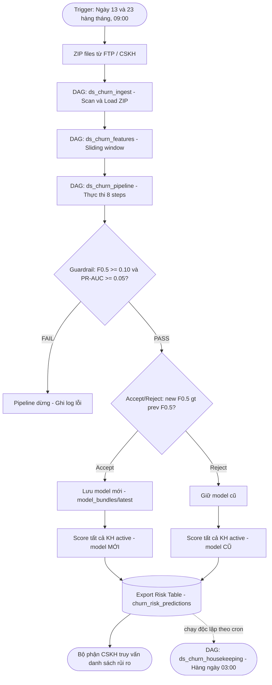

# DS Churn — Hệ thống Dự đoán Rời bỏ Khách hàng

Hệ thống ML pipeline end-to-end dự đoán khách hàng có nguy cơ rời bỏ (churn) dịch vụ chuyển phát, được thiết kế theo kiến trúc **Modular Monolith** và orchestrate qua **Apache Airflow** trên **Kubernetes**.

**Sản phẩm cuối cùng**: Mỗi tháng 2 lần, hệ thống tự động xuất danh sách **top 10% khách hàng rủi ro cao nhất** kèm xác suất churn và lý do (top-3 feature ảnh hưởng) vào bảng PostgreSQL `data_static.churn_risk_predictions` để bộ phận CSKH chủ động liên hệ giữ chân.

---

## 1. Tổng quan Bài toán

### 1.1 Mục tiêu
Dự đoán khách hàng nào sẽ ngừng sử dụng dịch vụ trong **H tháng tới** (mặc định H=2), từ đó:
- Phát hiện sớm khách hàng có xu hướng rời bỏ
- Cung cấp danh sách rủi ro hàng tháng cho bộ phận CSKH
- Đưa ra lý do churn (top-3 feature ảnh hưởng) cho mỗi khách hàng

### 1.2 Định nghĩa Churn
- **y = 1** (churn): Khách hàng **không có item lẫn không có doanh thu** (`item_count == 0 AND total_fee == 0`) trong horizon [T+1, T+H]
- **y = 0** (active): Khách hàng có ít nhất 1 item HOẶC doanh thu > 0 trong horizon

### 1.3 Dữ liệu đầu vào
| Nguồn | Mô tả |
|-------|--------|
| `public.cas_customer` | Bảng giao dịch hàng tháng (item_count, total_fee, complaint, satisfaction, delay...) |
| `data_window.cus_feature_*` | Bảng sliding window features đã tính |
| CSKH evaluation files | Danh sách confirmed churners từ bộ phận Chăm sóc Khách hàng (format: `Roi_bo_MM_YY.csv`) |

---

## 2. Kỹ thuật & Phương pháp (Luồng Xử lý & Prototype)

### 2.1 Pipeline Tổng Quan (System Flow)

Dưới đây là sơ đồ luồng dữ liệu toàn hệ thống từ khâu kéo dữ liệu (Ingestion) qua xử lý (Window Aggregation), tính toán đặc trưng (Dataset Prep) đến dự đoán và xuất kết quả:


### 2.2 Công thức Xử lý Sliding Window ($W$ tháng)

Với mỗi khách hàng tại thời điểm quan sát $T$, dữ liệu được tổng hợp lùi về quá khứ qua $W$ tháng. Hệ thống tổng hợp các thông số như `item_sum`, `revenue_sum`, `delay_sum`, `satisfaction_avg`, v.v.

Ký hiệu $X_{t}$ là giá trị của metrics tại tháng $t$. Các cột feature được trải phẳng (pivot) thành các mốc thời gian tương đối:
- **Tháng hiện tại**: $X_{last} = X_{T}$
- **Tháng trước đó**: $X_{1m\_ago} = X_{T-1}$
- **...**
- **Tháng cũ nhất trong Window**: $X_{(W-1)m\_ago} = X_{T-W+1}$

### 2.3 Công thức EWMA (Exponentially Weighted Moving Average)

Để nắm bắt xu hướng thay đổi hành vi dài hạn (có trượt trọng số ưu tiên dữ liệu gần), hệ thống áp dụng EWMA cho 7 nhóm signals:

$$ EWMA_t = \alpha \cdot X_t + (1 - \alpha) \cdot EWMA_{t-1} $$

Ngoài ra, hệ thống trích xuất động lượng thay đổi biểu hiện rủi ro ngắn hạn (Delta Trend) bằng cách trừ hai kỳ EWMA gần nhất:

$$ \Delta EWMA = EWMA_{last} - EWMA_{penultimate} $$

Output features:
- `ewma_{prefix}`: Thể hiện quỹ đạo xu hướng đã làm mượt.
- `delta_ewma_{prefix}`: Ghi nhận sự sụt giảm/tăng tốc ($<0$ mang ý nghĩa cảnh báo sụt giảm hoạt động).

### 2.4 Tính toán Leading Prototype & Pseudo-labeling

Do giới hạn về nhãn thực tế, hệ thống trích xuất đặc trưng của tập khách hàng đã rời bỏ (Confirmed Churners) tại mốc thời gian T-2 tháng để xây dựng **Prototype**:

1. **Center Vector (Trọng tâm)** $\mu$:
$$ \mu_j = \frac{1}{N_{churn}} \sum_{i=1}^{N_{churn}} x_{i,j} $$

2. **Inverse Covariance (Ma trận hiệp phương sai nghịch đảo)** $\Sigma^{-1}$:
Sử dụng Covariance có Regularization (LW Shrinkage hoặc Ledoit-Wolf) để bù đắp biểu hiện nhiễu (noise) lấn át các features quan trọng.

3. **Mahalanobis Distance ($D_M$)**: Tính khoảng cách đặc trưng phân phối của mọi khách hàng active $x$ so với Prototype $\mu$:
$$ D_M(x) = \sqrt{(x - \mu)^T \Sigma^{-1} (x - \mu)} $$

4. **Biến đổi thành Similarity Score**:
Biến đổi nghịch đảo khoảng cách thành điểm Similarity để đối chiếu với ngưỡng (`sim_threshold`). Khách hàng có cấu trúc hành vi (distance) gần nhóm Churn nhất + có Tín hiệu rớt số (`delta_ewma < 0`) $\rightarrow$ Gán nhãn `pseudo_churn`.

### 2.5 Ước lượng Trọng số PU Learning (Positive-Unlabeled)

Theo định lý Elkan-Noto cho bài toán PU Learning, xác suất để một mẫu Positive ($y=1$) thực sự được dán nhãn (labeled $s=1$) được coi là hằng số:
$$ c = P(s=1|y=1) $$
Vì tập Negative không có ground-truth thực sự, ta ước lượng hằng số $c$ theo tỷ lệ:
$$ c = \frac{N_{confirmed}}{N_{unlabeled}} $$
*(Được kẹp giới hạn clamp tại giá trị min là `0.01`)*

Sau đó, tiến hành thiết lập cơ chế đánh trọng số mẫu (Sample Weights $w_i$) và nhãn mềm (Label Smoothing) áp dụng trực tiếp cho mô hình XGBoost:

| Nguồn Nhãn (Label Source) | Trọng số ($w_i$) | Nhãn mục tiêu ($y_i$) |
|-----------------------|----------------|---------------------|
| `confirmed` (Rời bỏ thật)| $1.0$ | $1.00$ |
| `pseudo_churn` (Giống rời bỏ)| $c$ | $0.90$ |
| `reliable_neg` (Đang phát triển)| $1.0$ | $0.00$ |
| `pu_unlabeled` (Chưa rõ)| $c$ | $c$ |

### 2.6 Modeling (XGBoost) & Phương pháp tính toán đánh giá

| Thuộc tính | Chi tiết |
|--------|--------|
| Algorithm | XGBoost (`binary:logistic`) |
| Eval metric | `logloss` + `aucpr` (PR-AUC) |
| Threshold | Optimal F0.5 threshold (auto-selected) |
| Guardrail | min_f0.5 = 0.10, min_pr_auc = 0.05 |
| Accept/Reject | New F0.5 > prev_F0.5 + ε |
| Scoring | Top 10% dynamic threshold (percentile-based) |

**Guardrail & Accept/Reject Logic:**

1. **Guardrail Check** (cổng chất lượng tối thiểu): Sau khi train, hệ thống kiểm tra F0.5 ≥ 0.10 và PR-AUC ≥ 0.05. Nếu **không đạt** → pipeline dừng ngay, không deploy model.
2. **Accept/Reject Decision** (so sánh với model trước): Nếu đạt guardrail, hệ thống so sánh F0.5 mới với F0.5 của model đã được accepted trước đó. Chỉ chấp nhận model mới nếu `new_f05 > prev_f05 + ε`. Nếu bị reject, hệ thống vẫn dùng model cũ (đã lưu trong bundle) để scoring.
3. **Scoring**: Dù model mới bị reject hay accept, pipeline vẫn **luôn score** tất cả khách hàng active. Nếu reject, dùng model cũ; nếu accept, dùng model mới.

---

## 3. Kiến trúc Hệ thống

### 3.1 Cấu trúc thư mục

```text
ds_churn/
├── dags/                           # Airflow DAGs
│   ├── ds_churn_ingest.py          #   Scheduled: scan ZIP → validate
│   ├── ds_churn_features.py        #   Triggered: feature generation
│   ├── ds_churn_pipeline.py        #   Triggered: dataset prep + model v2
│   └── ds_churn_housekeeping.py    #   Scheduled: cleanup old bundles
│
├── src/                            # Source code (pip install -e .)
│   ├── config/                     #   Centralized config (Pydantic-based)
│   │   ├── settings.py             #     Root AppSettings (composes all subsystem configs)
│   │   ├── db_config.py            #     PostgresConfig (PG_HOST, PG_PORT, PG_DB, PG_USER, PG_PW)
│   │   └── paths.py                #     FSConfig (INCOMING/SAVED/FAIL_DIR) + ModelPathsConfig
│   ├── shared/                     #   Shared utilities
│   │   ├── db.py                   #     get_engine() — SQLAlchemy engine factory
│   │   └── logging_config.py       #     configure_logging() — rotating file + console
│   ├── data/
│   │   ├── ingestion/              #   Data extraction and loading logic
│   │   ├── preprocessing/          #   Data handling logic (transformations)
│   │   │   └── dataset_prep/       #   13 modules (scope→tier→EWMA→W*→prototype→pseudo→weight→sanity)
│   │   └── validation/             #   Data quality checks (schema validation)
│   ├── features/
│   │   └── engineering/
│   │       └── feature_gen/        #   Sliding window SQL + aggregation
│   ├── modeling/
│   │   ├── config/                 #   ModelConfig (XGBoost hyperparams)
│   │   ├── train/                  #   trainer, evaluator, guardrail
│   │   ├── export/                 #   scorer, risk_table
│   │   ├── common/                 #   artifacts (save/load bundles via joblib)
│   │   └── config_store/           #   best_config (accept/reject history in DB)
│   ├── pipelines/
│   │   └── monthly/                #   monthly_v2.py & monthly_v2_cli.py (8-step orchestrator)
│   └── monitoring/                 #   Production monitoring
│       ├── data_quality/           #     Data quality monitoring
│       └── model_quality/          #     Model quality monitoring
│
├── infrastructure/                 # Deployment configs
│   └── docker-compose.yaml         # Docker setup
│
├── data/                           # Data storage (mount data volumes)
├── logs/                           # Runtime logs
├── tests/                          # Unit tests (105 tests)
├── infrastructure/                 # Docker + Helm charts
│   ├── Dockerfile.app              #   Application image (churn_app:latest)
│   ├── Dockerfile.airflow          #   Airflow image
│   ├── docker-compose.yaml         #   Local development stack
│   └── helm/
│       ├── airflow/                #   Airflow Helm values (values.yaml + values-local.yaml)
│       └── monitoring/             #   Kube-prometheus-stack Helm values
│
├── docs/                           # Tài liệu chi tiết
│   ├── architecture/               #   System architecture, data flow, deployment guide
│   ├── operations/                 #   Monitoring guide, troubleshooting, incident response
│   ├── models/                     #   Model card, feature docs, performance reports
│   ├── adr/                        #   Architecture Decision Records
│   └── api/                        #   API spec + client examples
│
├── Coding_conventions/             # Project coding standards (18 files)
├── pyproject.toml                  # Packaging & tool config
└── .env                            # Database credentials (not committed)
```

### 3.2 Luồng Vận hành Production (End-to-End Data Flow)



**Tóm tắt luồng:**
1. **Trigger tự động**: ZIP files được drop vào `incoming/` → DAG `ds_churn_ingest` quét ngày 13 & 23 hàng tháng lúc 09:00.
2. **Chain reaction**: Ingest thành công → tự động trigger `ds_churn_features` → tự động trigger `ds_churn_pipeline`.
3. **Output**: Bảng `data_static.churn_risk_predictions` được TRUNCATE và ghi mới mỗi lần chạy — luôn là snapshot mới nhất.
4. **CSKH consume**: Bộ phận CSKH query trực tiếp từ PostgreSQL hoặc export CSV từ bảng risk.

### 3.3 Airflow DAG Chain

Hệ thống xử lý logic dự đoán hàng tháng qua một chu trình 8 bước tuần tự chặt chẽ, tách biệt rạch ròi quá trình Train và Inference:

| DAG | Schedule | Trigger | Retries | Mô tả |
|-----|----------|---------|---------|--------|
| `ds_churn_ingest` | `0 9 13,23 * *` | Cron | 2 | Scan ZIP → Load DB → Validate → trigger features |
| `ds_churn_features` | None | Triggered by ingest | 1 | Sliding window feature generation → trigger pipeline |
| `ds_churn_pipeline` | None | Triggered by features | 0 | Full 8-step pipeline (dataset prep + model + score + export) |
| `ds_churn_housekeeping` | `0 3 * * *` | Cron (hàng ngày) | 0 | Dọn bundles cũ, logs, saved/failed data |

Tất cả tasks chạy qua **KubernetesPodOperator** — mỗi task là 1 isolated Pod với image `churn_app:latest`. Pod tự hủy sau khi hoàn thành (`is_delete_operator_pod=True`).

### 3.4 Monthly v2 Pipeline — 8 Steps

```
Step 1: Dataset Prep         → DatasetResult (x_train, y_train, w_train, x_eval, y_eval, x_predict)
Step 2: Train XGBoost        → Booster model
Step 3: Evaluate             → F0.5, PR-AUC, threshold
Step 4: Guardrail            → Pass/Fail (min quality gates)
Step 5: Accept/Reject        → Compare F0.5 vs previous accepted model
Step 6: Save Bundle          → joblib model + metadata.json to disk
Step 7: Score All            → churn_probability + churn_flag for all active customers
Step 8: Export Risk Table    → TRUNCATE + INSERT predictions to PostgreSQL
```

**Chi tiết Step 7 — Scoring Logic:**
- Score **tất cả** khách hàng active (không chỉ flagged)
- Tính `churn_probability` cho mỗi KH
- Áp dụng **dynamic threshold**: lấy percentile thứ 90 (top 10%) của phân phối probability → so sánh với threshold từ evaluation → chọn giá trị cao hơn
- Kết quả: chỉ ~10% KH có `churn_flag = 1` → tránh gửi alert quá nhiều cho CSKH
- Với mỗi KH flagged, tính **top-3 reasons** dựa trên global feature importance (gain) của XGBoost

### 3.5 Fallback Mode (khi thiếu CSKH file)

Hệ thống hỗ trợ **Fallback Mode** khi không có file CSKH (confirmed churn list) mới:

```
Có CSKH file? ─── Có ──→ Build prototype mới → Cache vào DB → Pseudo-labeling bình thường
       │
       Không
       │
       ▼
allow_prototype_fallback = True? ─── Không ──→ ⛔ Pipeline dừng + báo lỗi
       │
       Có
       │
       ▼
Có cached prototype trong DB (< 3 tháng)? ─── Không ──→ ⛔ Pipeline dừng
       │
       Có
       │
       ▼
✅ FALLBACK MODE: Dùng cached prototype
   - PU weight dùng giá trị ước lượng (fallback_pu_weight = 0.05)
   - eval_ids rỗng → model evaluation bị skip
   - Pipeline vẫn chạy scoring bình thường
   - Log WARNING rõ ràng để team biết
```

**Khi nào xảy ra Fallback:**
- Bộ phận CSKH chưa gửi file đánh giá tháng mới
- File CSV bị lỗi format hoặc không có cột `cms_code_enc`
- Thư mục CSKH trống

**Giới hạn:** Prototype fallback tối đa **3 tháng** (`max_prototype_age_months`). Nếu quá hạn, pipeline sẽ dừng và yêu cầu CSKH cung cấp dữ liệu mới.

---

## 4. Database Schema

### 4.1 Các bảng/schema chính

| Schema | Bảng | Mô tả | Ghi bởi |
|--------|------|-------|---------|
| `public` | `cas_customer` | Giao dịch hàng tháng gốc (raw transactional data) | Ingestion pipeline |
| `data_static` | `cus_lifetime` | Tổng hợp lifetime metrics (tenure, lifetime_total_items, ...) | Feature gen |
| `data_window` | `cus_feature_{W}m_{YYMM}` | Sliding window features (W tháng, tính đến YYMM) | Feature gen |
| `data_static` | `churn_risk_predictions` | **Output chính** — danh sách KH rủi ro | Monthly pipeline Step 8 |
| `data_static` | `best_config` | Lịch sử accept/reject model (F0.5, threshold, ...) | Monthly pipeline Step 5 |
| `cskh` | `confirmed_churners` | Danh sách confirmed churners load từ CSV | CSKH loader |
| `data_static` | `prototype_cache` | Cached leading prototype (μ, Σ⁻¹) cho fallback mode | Dataset prep Step 5 |

### 4.2 Output Schema — `data_static.churn_risk_predictions`

Đây là bảng sản phẩm cuối cùng mà bộ phận CSKH truy vấn:

| Cột | Kiểu | Mô tả |
|-----|------|-------|
| `id` | SERIAL PK | Auto-increment |
| `cms_code_enc` | VARCHAR(100) | Mã khách hàng (encrypted) |
| `churn_probability` | FLOAT | Xác suất churn (0.0 → 1.0) |
| `churn_flag` | INT | 1 = rủi ro cao, 0 = bình thường |
| `threshold_used` | FLOAT | Ngưỡng phân loại đã dùng |
| `reason_1` | TEXT | Lý do churn hàng đầu (vd: "High pct_delay") |
| `reason_2` | TEXT | Lý do thứ 2 |
| `reason_3` | TEXT | Lý do thứ 3 |
| `scored_at` | TIMESTAMP | Thời điểm scoring |
| `window_end` | INT | Tháng cuối của feature window (YYMM) |
| `w_star` | INT | Window size tối ưu W* |
| `horizon` | INT | Horizon dự đoán (mặc định: 2) |

**Lưu ý**: Bảng được **TRUNCATE** trước mỗi lần insert → luôn chứa snapshot mới nhất, không tích lũy dữ liệu cũ.

### 4.3 Model Config History — `data_static.best_config`

| Cột | Mô tả |
|-----|-------|
| `as_of_month` | Tháng chạy (YYMM, vd: 2604) |
| `horizon` | Horizon dự đoán |
| `best_threshold` | Threshold tối ưu từ evaluation |
| `metric_f1_val` | F0.5 score (stored in legacy F1 column) |
| `metric_pr_auc_val` | PR-AUC score |
| `is_accepted` | Model có được chấp nhận không |
| `accept_rule` | Lý do accept/reject |
| `prev_accepted_f1` | F0.5 của model trước |
| `accepted_at` | Timestamp |

---

## 5. Danh sách Feature đầy đủ

Hệ thống sử dụng **70+ features** được nhóm như sau:

### 5.1 Transaction Volume (Khối lượng giao dịch)

| Feature | Mô tả |
|---------|--------|
| `item_sum` | Tổng số item trong window |
| `item_avg` | Trung bình item/tháng |
| `item_std` | Độ lệch chuẩn item |
| `item_median` | Trung vị item |
| `revenue_sum` | Tổng doanh thu |
| `revenue_avg` | Trung bình doanh thu/tháng |
| `revenue_std` | Độ lệch chuẩn doanh thu |

### 5.2 Service Quality (Chất lượng dịch vụ)

| Feature | Mô tả |
|---------|--------|
| `complaint_sum` | Tổng số khiếu nại |
| `complaint_avg` | Trung bình khiếu nại/tháng |
| `weight_sum` | Tổng trọng lượng hàng |
| `weight_avg` | Trung bình trọng lượng/tháng |
| `avg_revenue_per_item` | Doanh thu trung bình mỗi item |
| `pct_delay` | % đơn hàng bị delay |
| `pct_refund` | % đơn hoàn trả |
| `pct_noaccepted` | % đơn không được chấp nhận |
| `pct_lost_order` | % đơn bị mất |
| `pct_complaint` | % khiếu nại trên tổng đơn |
| `pct_successful_item` | % item giao thành công |
| `avg_delayday` | Số ngày delay trung bình |

### 5.3 Customer Satisfaction (Hài lòng khách hàng)

| Feature | Mô tả |
|---------|--------|
| `order_score_avg` | Điểm đánh giá đơn hàng trung bình |
| `satisfaction_avg` | Điểm hài lòng trung bình |

### 5.4 Geographic (Địa lý)

| Feature | Mô tả |
|---------|--------|
| `pct_intra_province` | % đơn nội tỉnh |
| `pct_international` | % đơn quốc tế |

### 5.5 Activity & Engagement (Hoạt động)

| Feature | Mô tả |
|---------|--------|
| `active_months` | Số tháng có hoạt động |
| `inactive_months` | Số tháng không hoạt động |
| `active_days` | Số ngày có hoạt động |
| `inactive_days` | Số ngày không hoạt động |
| `avg_noservice_days` | Số ngày trung bình không sử dụng dịch vụ |
| `avg_lastday` | Số ngày trung bình kể từ lần cuối sử dụng |

### 5.6 Trend (Xu hướng)

| Feature | Mô tả |
|---------|--------|
| `item_slope` | Hệ số hồi quy (slope) của item theo thời gian |
| `revenue_slope` | Slope doanh thu |
| `satisfy_slope` | Slope satisfaction |
| `complaint_slope` | Slope khiếu nại |

### 5.7 Variability (Biến động)

| Feature | Mô tả |
|---------|--------|
| `cv_item` | Coefficient of Variation — item |
| `cv_revenue` | Coefficient of Variation — doanh thu |
| `item_range` | max(item) - min(item) trong window |
| `revenue_range` | max(revenue) - min(revenue) trong window |

### 5.8 Service Mix (Phân bổ dịch vụ)

| Feature | Mô tả |
|---------|--------|
| `service_types_used` | Số loại dịch vụ đã sử dụng |
| `dominant_service_ratio` | Tỷ lệ dịch vụ chính / tổng |
| `ser_c_sum` | Tổng dịch vụ loại C (chuyển phát nhanh) |
| `ser_e_sum` | Tổng dịch vụ loại E (EMS) |
| `ser_m_sum` | Tổng dịch vụ loại M |
| `ser_p_sum` | Tổng dịch vụ loại P (bưu kiện) |
| `ser_r_sum` | Tổng dịch vụ loại R |
| `ser_u_sum` | Tổng dịch vụ loại U |
| `ser_l_sum` | Tổng dịch vụ loại L (logistics) |
| `ser_q_sum` | Tổng dịch vụ loại Q |

### 5.9 RFM (Recency-Frequency-Monetary)

| Feature | Mô tả |
|---------|--------|
| `recency` | Số ngày kể từ giao dịch cuối |
| `frequency` | Tần suất giao dịch |
| `monetary` | Tổng giá trị tiền tệ |

### 5.10 EWMA — Multi-signal (14 features)

| Feature | Mô tả |
|---------|--------|
| `ewma_item` | EWMA item (smoothed recent trend) |
| `delta_ewma_item` | Δewma item (xu hướng tức thời) |
| `ewma_revenue` | EWMA doanh thu |
| `delta_ewma_revenue` | Δewma doanh thu |
| `ewma_complaint` | EWMA khiếu nại |
| `delta_ewma_complaint` | Δewma khiếu nại |
| `ewma_delay` | EWMA delay |
| `delta_ewma_delay` | Δewma delay |
| `ewma_nodone` | EWMA đơn chưa hoàn thành |
| `delta_ewma_nodone` | Δewma đơn chưa hoàn thành |
| `ewma_order` | EWMA đơn hàng |
| `delta_ewma_order` | Δewma đơn hàng |
| `ewma_satisfaction` | EWMA satisfaction |
| `delta_ewma_satisfaction` | Δewma satisfaction |

### 5.11 Legacy (Backward compatibility)

| Feature | Mô tả |
|---------|--------|
| `ewma` | Alias cho `ewma_item` (tương thích ngược) |
| `delta_ewma` | Alias cho `delta_ewma_item` (tương thích ngược) |

---

## 6. Cài đặt & Triển khai

### 6.1 Prerequisites

- Python ≥ 3.10
- PostgreSQL ≥ 14
- Docker + Docker Compose (cho Airflow)
- Kubernetes cluster (Docker Desktop hoặc production K8s)
- Helm (cho deployment Airflow + Monitoring)

### 6.2 Development Setup

```bash
# Clone repository
git clone <repo-url> ds_churn
cd ds_churn

# Tạo virtual environment
python -m venv .venv
source .venv/bin/activate       # Linux/Mac
# .venv\Scripts\activate        # Windows

# Install (editable mode + dev tools)
pip install -e ".[dev]"

# Cấu hình database
cp .env.example .env
# Sửa .env với credentials thực tế (xem §6.3)

# Chạy tests
pytest
```

### 6.3 Biến môi trường (`.env`)

| Biến | Bắt buộc | Default | Mô tả |
|------|----------|---------|--------|
| **Database** | | | |
| `PG_HOST` | ✅ | — | PostgreSQL host |
| `PG_PORT` | ❌ | `5432` | PostgreSQL port |
| `PG_DB` | ✅ | — | Database name |
| `PG_USER` | ✅ | — | Database user |
| `PG_PW` | ✅ | — | Database password |
| **File System** | | | |
| `INCOMING_DIR` | ❌ | `/churn_data/incoming` | Thư mục chứa ZIP files đầu vào |
| `SAVED_DIR` | ❌ | `/churn_data/saved` | Thư mục lưu data đã xử lý thành công |
| `FAIL_DIR` | ❌ | `/churn_data/failed` | Thư mục lưu data lỗi |
| **CSKH** | | | |
| `CSKH_DIR` | ❌ | `/churn_data/cskh_confirm_churn` | Thư mục chứa file `Roi_bo_MM_YY.csv` từ CSKH |
| `CSKH_FILE_PATH` | ❌ | — | Path cụ thể đến file CSKH (single file mode) |
| **Model** | | | |
| `CHURN_MODEL_DIR` | ❌ | `./model_bundles` | Thư mục lưu model bundles |
| **Logging** | | | |
| `LOGS_DIR` | ❌ | `/logs` | Thư mục log files |

> **Lưu ý:** Trên K8s, các biến DB được inject qua Kubernetes Secret (`churn-db-secret`), không đọc từ file `.env`. Xem §6.4.

### 6.4 Kubernetes Deployment

Hệ thống được thiết kế bắt buộc triển khai qua **KubernetesPodOperator** trên K8s bằng Helm. Tuyệt đối không dùng docker-compose cho môi trường chạy Dataset Prep / Modeling vì sẽ vượt quá giới hạn RAM.

**1. Build Docker Image**
```bash
docker build -t churn_app:latest -f infrastructure/Dockerfile.app .
```

**2. Tạo K8s Secrets**
```bash
kubectl create secret generic churn-db-secret --from-env-file=".env" -n default
```
*(Nếu dùng GitSync, tạo thêm secret `airflow-git-ssh-key`).*

**3. Cài đặt Airflow bằng Helm**
```bash
helm repo add apache-airflow https://airflow.apache.org
helm repo update

# Deploy Airflow
helm upgrade --install airflow apache-airflow/airflow \
  --namespace default \
  -f infrastructure/helm/airflow/values.yaml \
  -f infrastructure/helm/airflow/values-local.yaml
```

**4. Cài đặt Monitoring Stack (Prometheus + Grafana)**
```bash
helm repo add prometheus-community https://prometheus-community.github.io/helm-charts
helm repo update

helm upgrade --install monitoring prometheus-community/kube-prometheus-stack \
  --namespace monitoring --create-namespace \
  -f infrastructure/helm/monitoring/values.yaml
```

**5. Truy cập UI**
```bash
# Airflow Web UI
kubectl port-forward svc/airflow-api-server 8080:8080 -n default

# Grafana Dashboard
kubectl port-forward svc/monitoring-grafana 3000:80 -n monitoring
# Login: admin / admin
```

> **Lưu ý Path trên Windows:** Nếu test bằng Docker Desktop, đường dẫn mount trong YAML phải dùng format: `/run/desktop/mnt/host/d/...` thay vì `D:\...`

### 6.5 Chạy Pipeline thủ công (không qua Airflow)

```bash
# Từ thư mục gốc, với PYTHONPATH=src
export PYTHONPATH=src

# Chạy full pipeline
python -m pipelines.monthly.monthly_v2_cli

# Chỉ chạy dataset_prep (debug)
python -c "
from shared.db import get_engine
from data.preprocessing.dataset_prep.pipeline_config import DatasetPipelineConfig
from data.preprocessing.dataset_prep.run_dataset_pipeline import run_dataset_pipeline

engine = get_engine()
config = DatasetPipelineConfig(horizon_months=2)
result = run_dataset_pipeline(engine, config)
print(f'Train: {len(result.x_train)}, Eval: {len(result.x_eval)}')
"
```

### 6.6 Chạy Tests

```bash
# Tất cả tests
pytest

# Với coverage
pytest --cov=src --cov-report=html

# Chỉ module cụ thể
pytest tests/test_ewma.py -v
pytest tests/test_guardrail.py -v
```

---

## 7. Cấu hình

### 7.1 Dataset Pipeline Config

| Parameter | Default | Mô tả |
|-----------|---------|--------|
| `horizon_months` | 2 | Số tháng horizon dự đoán |
| `w_min` | 3 | Window size tối thiểu cho walk-forward search |
| `min_train_windows` | 5 | Số folds tối thiểu cho walk-forward validation |
| `data_start` | 2025-01-01 | Ngày bắt đầu dữ liệu |
| `alpha_ewma` | 0.3 | Smoothing factor cho EWMA |
| `sim_threshold` | 0.80 | Ngưỡng Mahalanobis similarity cho pseudo-churn |
| `trend_down_ratio` | 0.85 | Tỷ lệ giảm xu hướng (item_last < ratio × item_avg) |
| `pu_weight_min` | 0.01 | Giá trị tối thiểu cho PU weight |
| `min_prototype_samples` | 10 | Số confirmed churners tối thiểu để build prototype |
| `min_lifetime_orders` | 3 | Scope filter: tối thiểu số đơn lifetime |
| `recency_active` | 90 | Tier: KH active nếu giao dịch gần nhất ≤ 90 ngày |
| `recency_at_risk` | 180 | Tier: KH at_risk nếu giao dịch gần nhất ≤ 180 ngày |
| `recency_reliable_neg` | 30 | Recency ≤ 30 ngày → reliable negative |
| `sigma_reg` | 0.01 | Regularization cho covariance matrix inversion |
| `allow_prototype_fallback` | True | Cho phép dùng cached prototype khi thiếu CSKH |
| `max_prototype_age_months` | 3 | Prototype cache tối đa 3 tháng |
| `fallback_pu_weight` | 0.05 | PU weight ước lượng khi fallback |

### 7.2 Model Config

| Parameter | Default | Mô tả |
|-----------|---------|--------|
| `max_depth` | 6 | Độ sâu cây XGBoost |
| `learning_rate` | 0.05 | Tốc độ học |
| `n_estimators` | 500 | Số boosting rounds tối đa |
| `early_stopping_rounds` | 30 | Early stopping |
| `min_f1` | 0.10 | Guardrail: F0.5 tối thiểu |
| `min_pr_auc` | 0.05 | Guardrail: PR-AUC tối thiểu |
| `risk_threshold_pct` | 70.0 | Percentile cho ngưỡng risk |

---

## 8. Monitoring & Observability

### 8.1 Stack

| Dịch vụ | Chức năng | Namespace K8s | Port |
|---------|-----------|---------------|------|
| **Airflow Web UI** | Quản lý / Trigger Task, xem Log | `default` | 8080 |
| **Grafana** | Dashboard visualization | `monitoring` | 80 (forward → 3000) |
| **Prometheus** | Metrics storage + PromQL | `monitoring` | 9090 |

### 8.2 Dashboard quan trọng

| Dashboard | Khi nào xem | Mục đích |
|-----------|-------------|----------|
| **Node Exporter / Nodes** | Hàng ngày | RAM, CPU, Disk — phát hiện server hết tài nguyên |
| **Compute Resources / Pod** | Khi pipeline chạy | Monitor RAM/CPU của từng Pod XGBoost |
| **Compute Resources / Namespace (Pods)** | Tổng quan | Toàn cảnh tài nguyên namespace `default` |

### 8.3 PromQL mẫu

```promql
# Pod KPO bị Failed/Pending
kube_pod_status_phase{namespace="default", phase=~"Failed|Pending"} > 0

# RAM usage của Pipeline Pod
sum(container_memory_usage_bytes{namespace="default", pod=~"churn-pipeline-.*"}) by (pod)

# Airflow Scheduler có bị restart liên tục?
rate(kube_pod_container_status_restarts_total{namespace="default", container="airflow-scheduler"}[10m]) > 0
```

### 8.4 Tín hiệu cảnh báo

| Tín hiệu | Bệnh lý | Hành động |
|-----------|----------|-----------|
| Disk khả dụng < 15% | Log/cache tích tụ | Trigger `ds_churn_housekeeping` thủ công |
| Pipeline Pod chạm Memory Limit | Dataset quá lớn hoặc hyperparams nặng | Tăng `resources.requests.memory` trong Helm |
| Pod Pending > 30 phút | Cluster hết RAM | Scale-up node hoặc dừng DAG phụ trợ |

> **Chi tiết đầy đủ:** Xem [`docs/operations/monitoring_guide.md`](docs/operations/monitoring_guide.md)

---

## 9. Data Retention & Housekeeping

DAG `ds_churn_housekeeping` chạy **hàng ngày lúc 03:00** với chính sách giữ dữ liệu:

| Loại dữ liệu | Đường dẫn (trong container) | Retention | Mô tả |
|---------------|----------------------------|-----------|--------|
| **Model Bundles** | `${CHURN_MODEL_DIR}/bundles/` | Giữ 10 phiên bản gần nhất | Xóa bundles cũ nhất khi vượt quota |
| **Airflow Logs** | `/opt/airflow/logs/` | 30 ngày | Xóa `.log` files cũ |
| **Saved Data** | `/churn_data/saved/` | 90 ngày | Data đã xử lý thành công |
| **Failed Data** | `/churn_data/failed/` | 30 ngày | Data bị lỗi |
| **Incoming Data** | `/churn_data/incoming/` | 7 ngày | ZIP gốc chưa xử lý |

Tùy chỉnh qua environment variables:
```bash
BUNDLE_KEEP_COUNT=10     # Số bundles tối đa giữ lại
LOG_RETENTION_DAYS=30    # Ngày giữ log
SAVED_RETENTION_DAYS=90  # Ngày giữ saved data
FAIL_RETENTION_DAYS=30   # Ngày giữ failed data
INCOMING_RETENTION_DAYS=7 # Ngày giữ incoming data
```

---

## 10. Testing

| Test suite | Tests | Coverage |
|------------|-------|----------|
| `test_config.py` | 9 | PostgresConfig validation |
| `test_ewma.py` | 10 | Multi-signal EWMA, delta penultimate |
| `test_pipeline_config.py` | 11 | DatasetPipelineConfig validation |
| `test_pseudo_labeling.py` | 4 | Pseudo-label assignment |
| `test_sample_weighting.py` | 6 | PU weights, label smoothing |
| `test_sanity_checks.py` | 4 | Dataset sanity validation |
| `test_model_config.py` | 20 | ModelConfig validation + serialization |
| `test_evaluator.py` | 6 | F1 threshold selection |
| `test_guardrail.py` | 17 | Quality gates + accept/reject |
| `test_scorer.py` | 14 | Score stats + reasons generation |
| **Total** | **105** | |

```bash
# Chạy tất cả tests
pytest

# Với coverage HTML report
pytest --cov=src --cov-report=html

# Chạy test cụ thể
pytest tests/test_guardrail.py -v
```

---

## 11. Contributing

### 11.1 Coding Conventions

Dự án tuân thủ **18 file coding conventions** trong thư mục `Coding_conventions/`. Trước khi viết code, **bắt buộc** đọc:

1. `Coding_conventions/00-Index_and_glossary.md` — Mục lục + hướng dẫn đọc theo loại task
2. File convention tương ứng với task (xem §4 trong file mục lục)

### 11.2 Workflow phát triển

```bash
# 1. Tạo branch từ main
git checkout -b feature/<tên-tính-năng>

# 2. Viết code + tests
# ...

# 3. Chạy linting
ruff check src/ dags/

# 4. Chạy tests
pytest

# 5. Tạo Pull Request
git push origin feature/<tên-tính-năng>
```

### 11.3 Checklist trước khi submit PR

- [ ] Code tuân thủ conventions (chạy `ruff check` không lỗi)
- [ ] Tất cả tests pass (`pytest`)
- [ ] Có unit test cho logic mới
- [ ] Docstring đầy đủ cho mọi public function (Google style)
- [ ] Type hints cho mọi parameter và return value
- [ ] Không có secret trong code
- [ ] README/docs cập nhật nếu thay đổi behavior

### 11.4 Cấu trúc Import

Tuân theo `04-Dependencies_import_conventions`:
```
stdlib → third-party → project modules
```

Hướng phụ thuộc (dependency direction):
```
interface → application → domain ← infrastructure
                              ↑
                              └── shared/
```

---

## 12. Tài liệu chi tiết

| Tài liệu | Đường dẫn | Nội dung |
|-----------|-----------|----------|
| **System Architecture** | [`docs/architecture/system_architecture.md`](docs/architecture/system_architecture.md) | Sơ đồ C4, module boundaries |
| **Data Flow** | [`docs/architecture/data_flow.md`](docs/architecture/data_flow.md) | Chi tiết luồng dữ liệu từng giai đoạn |
| **Deployment Guide** | [`docs/architecture/deployment_guide.md`](docs/architecture/deployment_guide.md) | Hướng dẫn triển khai chi tiết |
| **Monitoring Guide** | [`docs/operations/monitoring_guide.md`](docs/operations/monitoring_guide.md) | Dashboard, PromQL, chiến lược giám sát |
| **Troubleshooting** | [`docs/operations/troubleshooting.md`](docs/operations/troubleshooting.md) | Lỗi thường gặp + cách khắc phục |
| **Incident Response** | [`docs/operations/incident_response.md`](docs/operations/incident_response.md) | Quy trình xử lý sự cố |
| **Model Card** | [`docs/models/model_card.md`](docs/models/model_card.md) | Model metadata, limitations |
| **Feature Documentation** | [`docs/models/feature_documentation.md`](docs/models/feature_documentation.md) | Chi tiết tính toán từng feature |
| **Performance Reports** | [`docs/models/performance_reports.md`](docs/models/performance_reports.md) | Kết quả đánh giá model |
| **ADRs** | [`docs/adr/`](docs/adr/) | Architecture Decision Records |
| **API Spec** | [`docs/api/api_spec.yaml`](docs/api/api_spec.yaml) | OpenAPI specification |
| **Coding Conventions** | [`Coding_conventions/00-Index_and_glossary.md`](Coding_conventions/00-Index_and_glossary.md) | Quy ước coding toàn dự án |

---

## 13. License

Internal use only — proprietary.
