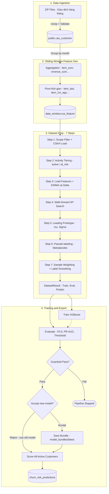

# DS Churn Prediction — Hệ thống Dự đoán Rời bỏ Khách hàng

Hệ thống ML pipeline end-to-end dự đoán khách hàng có nguy cơ rời bỏ (churn) dịch vụ chuyển phát, được thiết kế theo kiến trúc **Modular Monolith** và orchestrate qua **Apache Airflow** trên **Kubernetes**.

**Sản phẩm cuối cùng**: Mỗi tháng 2 lần, hệ thống tự động xuất danh sách **top 10% khách hàng rủi ro cao nhất** kèm xác suất churn và lý do (top-3 feature ảnh hưởng) vào bảng PostgreSQL `data_static.churn_risk_predictions` để bộ phận CSKH chủ động liên hệ giữ chân.

---

## 1. Mục tiêu hệ thống

DS Churn Prediction là hệ thống ML pipeline end-to-end dùng để phát hiện sớm các khách hàng có rủi ro rời bỏ (churn) dịch vụ chuyển phát. Hệ thống nhận dữ liệu giao dịch/khách hàng/khiếu nại theo tháng, tạo feature dạng lifetime và sliding window, chuẩn bị dataset churn bằng các kỹ thuật nâng cao (EWMA, walk-forward validation, pseudo-labeling), huấn luyện XGBoost, score toàn bộ khách hàng active và ghi kết quả vào PostgreSQL.

**Output nghiệp vụ chính:** Mỗi chu kỳ, hệ thống cập nhật danh sách các khách hàng có rủi ro cao (`churn_flag = 1`) kèm theo xác suất churn và top-3 lý do ảnh hưởng nhiều nhất vào bảng `data_static.churn_risk_predictions` để bộ phận CSKH có kế hoạch chủ động liên hệ giữ chân.

---

## 2. Kiến trúc tổng quan hiện tại

Hệ thống được thiết kế theo mô hình **Python Modular Monolith** phối hợp với **Apache Airflow Orchestration** và thực thi thông qua các isolated **KubernetesPodOperators**.

### 2.1 Sơ đồ luồng dữ liệu & DAG Chain



### 2.2 Công thức Xử lý Sliding Window ($W$ tháng)

Với mỗi khách hàng tại thời điểm quan sát $T$, dữ liệu được tổng hợp lùi về quá khứ qua $W$ tháng. Hệ thống tổng hợp các thông số như `item_sum`, `revenue_sum`, `delay_sum`, `satisfaction_avg`, v.v.

Ký hiệu $X_{t}$ là giá trị của metrics tại tháng $t$. Các cột feature được trải phẳng (pivot) thành các mốc thời gian tương đối:
- **Tháng hiện tại**: $X_{last} = X_{T}$
- **Tháng trước đó**: $X_{1m\_ago} = X_{T-1}$
- **...**
- **Tháng cũ nhất trong Window**: $X_{(W-1)m\_ago} = X_{T-W+1}$

### 2.3 Công thức EWMA (Exponentially Weighted Moving Average)

Để nắm bắt xu hướng thay đổi hành vi dài hạn (có trượt trọng số ưu tiên dữ liệu gần), hệ thống áp dụng EWMA cho 7 nhóm signals:

$$ EWMA_t = \alpha \cdot X_t + (1 - \alpha) \cdot EWMA_{t-1} $$

Ngoài ra, hệ thống trích xuất động lượng thay đổi biểu hiện rủi ro ngắn hạn (Delta Trend) bằng cách trừ hai kỳ EWMA gần nhất:

$$ \Delta EWMA = EWMA_{last} - EWMA_{penultimate} $$

Output features:
- `ewma_{prefix}`: Thể hiện quỹ đạo xu hướng đã làm mượt.
- `delta_ewma_{prefix}`: Ghi nhận sự sụt giảm/tăng tốc ($<0$ mang ý nghĩa cảnh báo sụt giảm hoạt động).

### 2.4 Tính toán Leading Prototype & Pseudo-labeling

Do giới hạn về nhãn thực tế, hệ thống trích xuất đặc trưng của tập khách hàng đã rời bỏ (Confirmed Churners) tại mốc thời gian T-2 tháng để xây dựng **Prototype**:

1. **Center Vector (Trọng tâm)** $\mu$:

   $$ \mu_j = \frac{1}{N_{churn}} \sum_{i=1}^{N_{churn}} x_{i,j} $$

2. **Inverse Covariance (Ma trận hiệp phương sai nghịch đảo)** $\Sigma^{-1}$:
Sử dụng Covariance có Regularization (LW Shrinkage hoặc Ledoit-Wolf) để bù đắp biểu hiện nhiễu (noise) lấn át các features quan trọng.

3. **Mahalanobis Distance ($D_M$)**: Tính khoảng cách đặc trưng phân phối của mọi khách hàng active $x$ so với Prototype $\mu$:

   $$ D_M(x) = \sqrt{(x - \mu)^T \Sigma^{-1} (x - \mu)} $$

4. **Biến đổi thành Similarity Score**:
Biến đổi nghịch đảo khoảng cách thành điểm Similarity để đối chiếu với ngưỡng (`sim_threshold`). Khách hàng có cấu trúc hành vi (distance) gần nhóm Churn nhất + có Tín hiệu rớt số (`delta_ewma < 0`) $\rightarrow$ Gán nhãn `pseudo_churn`.

### 2.5 Ước lượng Trọng số PU Learning (Positive-Unlabeled)

Theo định lý Elkan-Noto cho bài toán PU Learning, xác suất để một mẫu Positive ($y=1$) thực sự được dán nhãn (labeled $s=1$) được coi là hằng số:

$$ c = P(s=1|y=1) $$

Vì tập Negative không có ground-truth thực sự, ta ước lượng hằng số $c$ theo tỷ lệ:

$$ c = \frac{N_{confirmed}}{N_{unlabeled}} $$
*(Được kẹp giới hạn clamp tại giá trị min là `0.01`)*

Sau đó, tiến hành thiết lập cơ chế đánh trọng số mẫu (Sample Weights $w_i$) và nhãn mềm (Label Smoothing) áp dụng trực tiếp cho mô hình XGBoost:

| Nguồn Nhãn (Label Source) | Trọng số ($w_i$) | Nhãn mục tiêu ($y_i$) |
|-----------------------|----------------|---------------------|
| `confirmed` (Rời bỏ thật)| $1.0$ | $1.00$ |
| `pseudo_churn` (Giống rời bỏ)| $c$ | $0.90$ |
| `reliable_neg` (Đang phát triển)| $1.0$ | $0.00$ |
| `pu_unlabeled` (Chưa rõ)| $c$ | $c$ |

### 2.6 Modeling (XGBoost) & Phương pháp tính toán đánh giá

| Thuộc tính | Chi tiết |
|--------|--------|
| Algorithm | XGBoost (`binary:logistic`) |
| Eval metric | `logloss` + `aucpr` (PR-AUC) |
| Threshold | Optimal F0.5 threshold (auto-selected) |
| Guardrail | min_f0.5 = 0.10, min_pr_auc = 0.05 |
| Accept/Reject | New F0.5 > prev_F0.5 + ε |
| Scoring | Top 10% dynamic threshold (percentile-based) |

**Guardrail & Accept/Reject Logic:**

1. **Guardrail Check** (cổng chất lượng tối thiểu): Sau khi train, hệ thống kiểm tra F0.5 ≥ 0.10 và PR-AUC ≥ 0.05. Nếu **không đạt** → pipeline dừng ngay, không deploy model.
2. **Accept/Reject Decision** (so sánh với model trước): Nếu đạt guardrail, hệ thống so sánh F0.5 mới với F0.5 của model đã được accepted trước đó. Chỉ chấp nhận model mới nếu `new_f05 > prev_f05 + ε`. Nếu bị reject, hệ thống vẫn dùng model cũ (đã lưu trong bundle) để scoring.
3. **Scoring**: Dù model mới bị reject hay accept, pipeline vẫn **luôn score** tất cả khách hàng active. Nếu reject, dùng model cũ; nếu accept, dùng model mới.

---

## 3. Cấu trúc thư mục thực tế

```text
Churn_Prediction/
├── dags/                               # Các DAGs định nghĩa luồng chạy trong Airflow
│   ├── ds_churn_ingest.py              #   Scheduled: Ingest dữ liệu ZIP từ folder incoming
│   ├── ds_churn_features.py            #   Triggered: Sinh dữ liệu features (lifetime + window)
│   ├── ds_churn_eda.py                 #   Triggered: Sinh báo cáo phân tích dữ liệu (EDA) song song với features
│   ├── ds_churn_pipeline.py            #   Triggered: Huấn luyện, đánh giá, kiểm duyệt và chấm điểm khách hàng
│   └── ds_churn_housekeeping.py        #   Scheduled: Dọn dẹp dữ liệu cũ (daily 03:00)
├── src/                                # Source code của project (install dạng editable mode)
│   ├── config/                         #   Cấu hình hệ thống (settings, paths, db_config...)
│   ├── data/
│   │   ├── ingestion/                  #   Luồng nhận diện, giải nén và nạp dữ liệu nguyên bản
│   │   ├── preprocessing/dataset_prep/ #   7 bước xử lý dữ liệu đầu vào cho mô hình
│   │   ├── validation/                 #   Chương trình validate schema dữ liệu nguồn
│   │   └── eda/                        #   Bộ công cụ sinh HTML report phục vụ phân tích EDA
│   ├── features/engineering/feature_gen/ #   Tính toán lifetime và sliding-window features
│   ├── modeling/
│   │   ├── common/                     #   Kiểu dữ liệu chung và các utils lưu trữ artifacts
│   │   ├── config/                     #   Tham số cấu hình của XGBoost và metrics
│   │   ├── config_store/               #   Đồng bộ DB trạng thái accept/reject model
│   │   ├── export/                     #   Tính toán lý do và ghi nhận kết quả rủi ro vào DB
│   │   ├── sql/                        #   Các câu truy vấn SQL liên quan đến scoring/predict
│   │   └── train/                      #   Trainer, Evaluator và Guardrail chất lượng model
│   ├── monitoring/model_quality/monitoring/ #   Tính toán chỉ số PSI, Drift, Backtest chất lượng
│   ├── pipelines/monthly/              #   monthly_v2.py (Orchestrator chính) và CLI wrapper
│   ├── scripts/                        #   Bộ scripts khởi tạo schema & kiểm tra trạng thái DB
│   └── shared/                         #   Module dùng chung (kết nối DB engine, logging setup)
├── tests/                              # Bộ kiểm thử Unit test của hệ thống (~149 test functions)
├── docs/                               # Thư mục chứa các tài liệu chi tiết (ADR, C4 spec...)
├── infrastructure/                     # Helm chart và Docker configuration
│   ├── Dockerfile.app                  #   Dockerfile build ứng dụng chính (churn_app:v2)
│   ├── Dockerfile.airflow              #   Dockerfile build custom Airflow webserver/scheduler
│   ├── docker-compose.yaml             #   Setup môi trường local dev đầy đủ
│   ├── helm/                           #   Bản phân phối Helm values cho Airflow & Monitoring
│   └── kind/                           #   Cấu hình cụm Kubernetes local (Kind)
├── model_bundles/bundles/latest/       # Folder lưu trữ XGBoost model bundle đã được accepted
├── data/                               # Chứa dữ liệu (incoming, saved, failed)
├── pyproject.toml                      # Cấu hình package, pytest và ruff linter
├── requirements.txt                    # Danh sách các thư viện Python cài đặt
├── .env.example                        # Mẫu định dạng cấu hình biến môi trường
└── README.md                           # File tài liệu hướng dẫn này
```

---

## 4. Dữ liệu đầu vào và Database Schema

### 4.1 Các bảng nguồn Production

Ingestion hỗ trợ nạp dữ liệu định kỳ từ 4 nhóm bảng chính nằm ở schema `public`:

| Tên bảng nguồn | Định dạng nạp dữ liệu | Vai trò / Ý nghĩa |
|---|---|---|
| `bccp_orderitem` / `bccp_orderitem_YYMM` | Transaction chi tiết | Thông tin chi tiết về từng đơn hàng, sản phẩm, trạng thái và cước phí theo từng tháng |
| `cas_customer` | Tổng hợp khách hàng theo tháng | Bảng chứa doanh thu tổng, số đơn, số ngày hoạt động, khiếu nại của từng khách hàng hàng tháng |
| `cas_info` | Thông tin hồ sơ khách hàng | Lưu thông tin định danh, ngày ký hợp đồng, nhóm ngành hàng phục vụ tính toán tenure/lifetime |
| `cms_complaint` | Dữ liệu khiếu nại | Lưu thông tin các khiếu nại của khách hàng làm tín hiệu chất lượng dịch vụ |

### 4.2 Các schema và phân vùng dữ liệu chính trong PostgreSQL

Hệ thống quản lý dữ liệu chặt chẽ qua các schema chuyên biệt để bảo đảm tính bảo mật và tối ưu hóa truy vấn:

| Schema | Đối tượng / Bảng | Ý nghĩa sử dụng |
|---|---|---|
| `public` | `cas_customer`, `cas_info`, `cms_complaint`, `bccp_orderitem_YYMM` | Chứa dữ liệu thô (raw) và các bảng giao dịch tháng sau khi Ingest thành công |
| `ingest` | `ingest_log` | Ghi chép lịch sử file ZIP đã ingest (MD5 hash, số dòng nạp thành công, timestamp) |
| `data_static` | `cus_lifetime` | Bảng tích lũy lifetime metrics của khách hàng tính từ lúc hoạt động |
| `data_static` | `churn_risk_predictions` | Bảng **sản phẩm cuối** chứa danh sách khách hàng có rủi ro cao CSKH cần liên hệ |
| `data_static` | `best_config` | Lịch sử chấp nhận/từ chối mô hình mới và các thông số đánh giá (F0.5, PR-AUC, Threshold...) |
| `data_static` | `prototype_cache` | Lưu trữ trung tâm trọng tâm $\mu$ và ma trận hiệp phương sai $\Sigma^{-1}$ phục vụ Fallback Mode |
| `data_window` | `cus_feature_{W}m_{startYYMM}_{endYYMM}` | Bảng sliding-window feature được pivot động theo cấu trúc thời gian thực tế |
| `cskh` | `confirmed_churners` | Tập danh sách khách hàng xác nhận rời bỏ thu thập từ CSKH |

---

## 5. Airflow DAGs hiện tại

Toàn bộ các tác vụ xử lý ML nặng được cô lập trong **KubernetesPodOperator** sử dụng Docker Image `churn_app:v2`. Cơ chế này loại bỏ hoàn toàn rủi ro rò rỉ bộ nhớ hoặc xung đột tài nguyên trên Airflow Node.

| Tên DAG | Chu kỳ chạy (Schedule) | Tác nhân kích hoạt | Command trong Pod | Ý nghĩa / Vai trò |
|---|---|---|---|---|
| `ds_churn_ingest` | `0 9 13,23 * *` | Cron định kỳ | `python -m data.ingestion.cli scan --prod-schema public --ingest-schema ingest --xcom-out /airflow/xcom/return.json` | Quét folder `incoming`, giải nén file ZIP mới, validate cấu trúc, nạp dữ liệu PostgreSQL, ghi ingest log, trigger song song `ds_churn_features` và `ds_churn_eda` |
| `ds_churn_features` | Không (None) | Trigger bởi `ds_churn_ingest` | `python -m features.engineering.feature_gen.run_feature_generation --start 2025-01-01 --incremental` | Cập nhật bảng `cus_lifetime` và tính toán sliding window feature cho tất cả window size, trigger `ds_churn_pipeline` |
| `ds_churn_eda` | Không (None) | Trigger bởi `ds_churn_ingest` | `python -m data.eda.run_eda` | Chạy song song độc lập với features để phân tích chất lượng dữ liệu và xuất báo cáo EDA định kỳ dưới dạng HTML |
| `ds_churn_pipeline` | Không (None) | Trigger bởi `ds_churn_features` | `python -m pipelines.monthly.monthly_v2_cli` | Thực thi tuần tự 8 bước của pipeline: dataset prep → train XGBoost → evaluate → quality guardrail → accept/reject → score all → export DB |
| `ds_churn_housekeeping` | `0 3 * * *` | Cron định kỳ hằng ngày | Inline Bash script | Dọn dẹp logs, các folder dữ liệu tạm (`incoming`/`saved`/`failed`) và chỉ giữ lại số lượng Model Bundle cấu hình tối đa |

### 5.1 Volumes Mount và Secrets trong DAGs

- **Mount Path**: Các Pod thực thi ML mount thư mục dữ liệu từ Kind Node `/churn_data` vào thẳng `/churn_data` trong Container để đọc ghi file ZIP và CSKH.
- **Secrets Injection**: Thông tin xác thực PostgreSQL được tải động từ Kubernetes Secret có tên `churn-db-secret` và inject vào các biến môi trường của container lúc runtime để đảm bảo bảo mật.

---

## 6. Luồng Ingestion Chi Tiết

Entry point thực thi: `python -m data.ingestion.cli scan`.

Khi có file ZIP được đẩy vào thư mục `incoming/`, tiến trình Ingestion sẽ thực thi tuần tự theo các bước:

```
[Incoming ZIP detected] 
        │
        ▼
[Tính MD5 & So sánh DB] ─── (Đã tồn tại MD5) ───► [SKIP: Báo trùng lặp]
        │ (MD5 mới)
        ▼
[Giải nén & Discover CSV]
        │
        ▼
[Xác định bảng đích & Cấu hình Header]
        │
        ▼
[Validate Header vs EXPECTED_HEADERS] ─── (Sai cấu trúc) ───► [COPY file sang 'failed']
        │ (Khớp cấu trúc)
        ▼
[Transform data (Chống SQL injection, Encrypt IDs)]
        │
        ▼
[Thực thi SQL COPY atomic trong Transaction] ─── (Lỗi COPY) ───► [ROLLBACK & Move sang 'failed']
        │ (COPY thành công)
        ▼
[ANALYZE table + Ghi ingest_log + Move sang 'saved']
```

### Các đặc tính kỹ thuật quan trọng trong code Ingestion:
- **Tính Idempotent**: Quyết định bỏ qua file đã xử lý dựa trên mã MD5 lưu trong bảng `ingest.ingest_log` (md5-based check) thay vì dựa trên thời gian chỉnh sửa (mtime) để tránh bị nạp trùng khi file bị sao chép qua nhiều phân vùng.
- **Tính nguyên tử (Atomic)**: Thao tác `COPY` dữ liệu thô vào bảng production diễn ra trong cùng một SQL Transaction kèm theo `TRUNCATE` phân vùng tháng tương ứng. Nếu bất kỳ file CSV nào trong ZIP bị lỗi cấu trúc hoặc kiểu dữ liệu, toàn bộ phiên nạp dữ liệu của file ZIP đó sẽ bị `ROLLBACK` để bảo toàn tính nhất quán.
- **Chống SQL Injection**: Tích hợp các bộ lọc và kiểm tra ký tự nguy hiểm trước khi đẩy dữ liệu vào câu lệnh COPY.
- **Mã hóa thông tin nhạy cảm**: Sử dụng class `CustomerEncryption` để tự động hóa việc băm mã định danh khách hàng nhạy cảm trước khi lưu vào DB.

---

## 7. Feature Generation

Entry point thực thi: `python -m features.engineering.feature_gen.run_feature_generation --start 2025-01-01 --incremental`.

Quy trình tự động hóa việc tính toán đặc trưng:
1. Đọc và phân tách thông tin kết nối DB thông qua biến môi trường `DATABASE_URL` hoặc credentials chi tiết.
2. Quét kiểm tra sự tồn tại của các bảng dữ liệu nguồn bắt buộc trong `public`.
3. Tự động nhận diện tháng kết thúc (`end_month`) gần nhất của dữ liệu bằng cách quét các phân vùng `public.bccp_orderitem_YYMM`. Nếu không tìm thấy, hệ thống sẽ fallback sang dùng giá trị `MAX(public.cas_customer.report_month)`.
4. Khởi tạo/Cập nhật các schema `data_static` và `data_window` nếu chưa tồn tại.
5. Tổng hợp dữ liệu trọn đời của khách hàng và lưu trữ vào bảng tĩnh `data_static.cus_lifetime`.
6. Tính toán sliding-window features cho các mốc thời gian $W$ (ví dụ: 3 tháng, 6 tháng) dựa trên cơ chế kết hợp template SQL động.

**Cấu trúc đặt tên bảng sliding-window thực tế:**
```text
data_window.cus_feature_{W}m_{startYYMM}_{endYYMM}
```
*Ví dụ thực tế:* `data_window.cus_feature_3m_2501_2503` (Window 3 tháng từ 01/2025 đến 03/2025), `data_window.cus_feature_6m_2501_2506` (Window 6 tháng từ 01/2025 đến 06/2025).

---

## 8. Dataset Preparation — 7 Steps

Mỗi chu kỳ chạy pipeline, dữ liệu thô từ các bảng window sẽ được biến đổi qua 7 bước chuẩn bị nghiêm ngặt trước khi đưa vào mô hình học máy:

```
[Bảng window & cus_lifetime]
             │
             ▼
[Step 1: Scope Filter & CSKH Load] ◄─── Đọc confirmed churners từ CSV/XLSX
             │
             ▼
[Step 2: Activity Tiering] ─────────── Phân loại khách hàng (active, at_risk, churned)
             │
             ▼
[Step 3: Label Construction & EWMA] ── EWMA trends & Delta dynamics ($y_{raw}$ definition)
             │
             ▼
[Step 4: Walk-forward Validation] ──── Tìm window size tối ưu W*
             │
             ▼
[Step 5: Leading Prototype] ────────── Build center vector $\mu$ & ma trận nghịch đảo $\Sigma^{-1}$
             │ (Fallback dùng prototype cached trong DB nếu thiếu file CSKH)
             ▼
[Step 6: Pseudo-labeling] ──────────── Mahalanobis similarity & Delta trend check
             │
             ▼
[Step 7: Sample Weighting] ─────────── Elkan-Noto PU weighting & Label Smoothing
             │
             ▼
   [DatasetResult Output]
```

### 8.1 Chi tiết định nghĩa Churn Label
Nhãn mục tiêu thực tế ($y_{raw}$) được định nghĩa dựa trên khoảng thời gian Horizon ($H$, mặc định là 2 tháng):
- $y_{raw} = 1$ (Churn): Khách hàng **không phát sinh bất kỳ đơn hàng nào** và **không đem lại doanh thu** (`item_count == 0 AND total_fee == 0`) trong toàn bộ horizon $[T+1, T+H]$.
- $y_{raw} = 0$ (Active): Khách hàng có tối thiểu 1 đơn hàng hoặc doanh thu phát sinh $> 0$ trong horizon.

### 8.2 Định dạng dữ liệu đầu vào CSKH
Mô-đun `cskh_loader.py` hỗ trợ nạp dữ liệu từ cả hai định dạng file phổ biến:
- Tên file quy chuẩn: `Roi_bo_MM_YY.csv` hoặc `Roi_bo_MM_YY.xlsx`.
- Trường bắt buộc có trong file: `cms_code_enc`.
- Hệ thống hỗ trợ nạp trực tiếp qua biến `CSKH_FILE_PATH` hoặc tự động quét thư mục chỉ định `CSKH_DIR` để nạp dữ liệu vào bảng `cskh.confirmed_churners`.

### 8.3 Cơ chế Fallback Prototype nâng cao
Nếu bộ phận CSKH chưa gửi file confirmed churners mới của chu kỳ hiện tại, hệ thống hỗ trợ cơ chế tự động fallback dùng prototype cũ đã cache trong bảng `data_static.prototype_cache` nếu thỏa mãn các điều kiện:
- `allow_prototype_fallback = True`
- Tuổi thọ của prototype cache chưa vượt quá thời gian tối đa: `max_prototype_age_months = 3`
- Khớp cấu trúc với tham số `horizon_months` của pipeline hiện tại.

---

## 9. Modeling và Monthly Pipeline

Entry point kích hoạt: `python -m pipelines.monthly.monthly_v2_cli`.

Orchestrator chính `src/pipelines/monthly/monthly_v2.py` phối hợp chặt chẽ quy trình qua 8 bước:

```
Step 1: Dataset Prep       → Tạo DatasetResult (train, eval, predict)
Step 2: Train XGBoost      → Huấn luyện mô hình XGBoost với sample weights
Step 3: Evaluate           → Tính F1, F0.5, PR-AUC, ROC-AUC, tối ưu Threshold
Step 4: Guardrail Check    → Kiểm tra cổng chất lượng tối thiểu
Step 5: Accept/Reject      → So sánh F0.5 mô hình mới với mô hình được accepted trước đó
Step 6: Save Bundle        → Đóng gói lưu trữ joblib model + metadata vào disk nếu accept
Step 7: Score All Active   → Dự đoán churn probability + churn flag kèm lý do
Step 8: Export Risk Table  → TRUNCATE và ghi đè danh sách rủi ro vào PostgreSQL
```

### 9.1 Cấu hình tham số XGBoost hiện tại

Mô hình XGBoost sử dụng hàm mục tiêu `binary:logistic` với các siêu tham số mặc định:

| Tham số | Giá trị | Ý nghĩa |
|---|---:|---|
| `max_depth` | 6 | Độ sâu tối đa của cây quyết định |
| `learning_rate` | 0.05 | Tốc độ học |
| `n_estimators` | 500 | Số lượng cây quyết định tối đa |
| `early_stopping_rounds` | 30 | Dừng sớm nếu metric đánh giá không cải thiện sau 30 rounds |
| `subsample` | 0.8 | Tỷ lệ dòng subsample cho mỗi cây |
| `colsample_bytree` | 0.8 | Tỷ lệ cột subsample cho mỗi cây |
| `reg_alpha` | 0.1 | L1 regularization term |
| `reg_lambda` | 1.0 | L2 regularization term |
| `eval_metric` | `logloss`, `aucpr` | Metric giám sát trong lúc training |

### 5.6 Trend (Xu hướng)

| Feature | Mô tả |
|---------|--------|
| `item_slope` | Hệ số hồi quy (slope) của item theo thời gian |
| `revenue_slope` | Slope doanh thu |
| `satisfy_slope` | Slope satisfaction |
| `complaint_slope` | Slope khiếu nại |

### 5.7 Variability (Biến động)

| Feature | Mô tả |
|---------|--------|
| `cv_item` | Coefficient of Variation — item |
| `cv_revenue` | Coefficient of Variation — doanh thu |
| `item_range` | max(item) - min(item) trong window |
| `revenue_range` | max(revenue) - min(revenue) trong window |

### 5.8 Service Mix (Phân bổ dịch vụ)

| Feature | Mô tả |
|---------|--------|
| `service_types_used` | Số loại dịch vụ đã sử dụng |
| `dominant_service_ratio` | Tỷ lệ dịch vụ chính / tổng |
| `ser_c_sum` | Tổng dịch vụ loại C (chuyển phát nhanh) |
| `ser_e_sum` | Tổng dịch vụ loại E (EMS) |
| `ser_m_sum` | Tổng dịch vụ loại M |
| `ser_p_sum` | Tổng dịch vụ loại P (bưu kiện) |
| `ser_r_sum` | Tổng dịch vụ loại R |
| `ser_u_sum` | Tổng dịch vụ loại U |
| `ser_l_sum` | Tổng dịch vụ loại L (logistics) |
| `ser_q_sum` | Tổng dịch vụ loại Q |

### 5.9 RFM (Recency-Frequency-Monetary)

| Feature | Mô tả |
|---------|--------|
| `recency` | Số ngày kể từ giao dịch cuối |
| `frequency` | Tần suất giao dịch |
| `monetary` | Tổng giá trị tiền tệ |

### 5.10 EWMA — Multi-signal (14 features)

| Feature | Mô tả |
|---------|--------|
| `ewma_item` | EWMA item (smoothed recent trend) |
| `delta_ewma_item` | Δewma item (xu hướng tức thời) |
| `ewma_revenue` | EWMA doanh thu |
| `delta_ewma_revenue` | Δewma doanh thu |
| `ewma_complaint` | EWMA khiếu nại |
| `delta_ewma_complaint` | Δewma khiếu nại |
| `ewma_delay` | EWMA delay |
| `delta_ewma_delay` | Δewma delay |
| `ewma_nodone` | EWMA đơn chưa hoàn thành |
| `delta_ewma_nodone` | Δewma đơn chưa hoàn thành |
| `ewma_order` | EWMA đơn hàng |
| `delta_ewma_order` | Δewma đơn hàng |
| `ewma_satisfaction` | EWMA satisfaction |
| `delta_ewma_satisfaction` | Δewma satisfaction |

### 5.11 Legacy (Backward compatibility)

| Feature | Mô tả |
|---------|--------|
| `ewma` | Alias cho `ewma_item` (tương thích ngược) |
| `delta_ewma` | Alias cho `delta_ewma_item` (tương thích ngược) |

---

## 6. Cài đặt & Triển khai

### 6.1 Prerequisites

- Python ≥ 3.10
- PostgreSQL ≥ 14
- Docker + Docker Compose (cho Airflow)
- Kubernetes cluster (Docker Desktop hoặc production K8s)
- Helm (cho deployment Airflow + Monitoring)

### 6.2 Development Setup

```bash
# Clone repository
git clone <repo-url> ds_churn
cd ds_churn

# Tạo virtual environment
python -m venv .venv
source .venv/bin/activate       # Linux/Mac
# .venv\Scripts\activate        # Windows

# Install (editable mode + dev tools)
pip install -e ".[dev]"

# Cấu hình database
cp .env.example .env
# Sửa .env với credentials thực tế (xem §6.3)

# Chạy tests
pytest
```

### 6.3 Biến môi trường (`.env`)

| Biến | Bắt buộc | Default | Mô tả |
|------|----------|---------|--------|
| **Database** | | | |
| `PG_HOST` | ✅ | — | PostgreSQL host |
| `PG_PORT` | ❌ | `5432` | PostgreSQL port |
| `PG_DB` | ✅ | — | Database name |
| `PG_USER` | ✅ | — | Database user |
| `PG_PW` | ✅ | — | Database password |
| **File System** | | | |
| `INCOMING_DIR` | ❌ | `/churn_data/incoming` | Thư mục chứa ZIP files đầu vào |
| `SAVED_DIR` | ❌ | `/churn_data/saved` | Thư mục lưu data đã xử lý thành công |
| `FAIL_DIR` | ❌ | `/churn_data/failed` | Thư mục lưu data lỗi |
| **CSKH** | | | |
| `CSKH_DIR` | ❌ | `/churn_data/cskh_confirm_churn` | Thư mục chứa file `Roi_bo_MM_YY.csv` từ CSKH |
| `CSKH_FILE_PATH` | ❌ | — | Path cụ thể đến file CSKH (single file mode) |
| **Model** | | | |
| `CHURN_MODEL_DIR` | ❌ | `./model_bundles` | Thư mục lưu model bundles |
| **Logging** | | | |
| `LOGS_DIR` | ❌ | `/logs` | Thư mục log files |

> **Lưu ý:** Trên K8s, các biến DB được inject qua Kubernetes Secret (`churn-db-secret`), không đọc từ file `.env`. Xem §6.4.

### 6.4 Kubernetes Deployment

Hệ thống được thiết kế bắt buộc triển khai qua **KubernetesPodOperator** trên K8s bằng Helm. Tuyệt đối không dùng docker-compose cho môi trường chạy Dataset Prep / Modeling vì sẽ vượt quá giới hạn RAM.

**1. Build Docker Image**
```bash
# Build app image chạy ML tasks
docker build -t churn_app:v2 -f infrastructure/Dockerfile.app .

# Build custom Airflow image tích hợp DAGs
docker build -t churn_app_airflow:latest -f infrastructure/Dockerfile.airflow .
```

### 13.2 Tạo Kubernetes Secrets trên Cluster
```bash
# Khởi tạo DB secret nạp từ file .env local
kubectl create secret generic churn-db-secret --from-env-file=.env -n default

# (Tùy chọn) Tạo secret key để Airflow tự động đồng bộ DAGs từ Git qua SSH
kubectl create secret generic airflow-git-ssh-key --from-file=gitSshKey=<đường-dẫn-đến-private-key> -n default
```

### 13.3 Deploy Airflow thông qua Helm Chart
```bash
# Thêm và cập nhật repository chính thức của Airflow
helm repo add apache-airflow https://airflow.apache.org
helm repo update

# Deploy Airflow
helm upgrade --install airflow apache-airflow/airflow \
  --namespace default \
  -f infrastructure/helm/airflow/values.yaml \
  -f infrastructure/helm/airflow/values-local.yaml
```

### 13.4 Triển khai Monitoring Stack (Prometheus & Grafana)
```bash
# Thêm repository monitoring cộng đồng
helm repo add prometheus-community https://prometheus-community.github.io/helm-charts
helm repo update

# Cài đặt Prometheus stack sang namespace monitoring riêng biệt
helm upgrade --install monitoring prometheus-community/kube-prometheus-stack \
  --namespace monitoring --create-namespace \
  -f infrastructure/helm/monitoring/values.yaml
```

**5. Truy cập UI**
```bash
# Airflow Web UI
kubectl port-forward svc/airflow-api-server 8080:8080 -n default

# Grafana Dashboard
kubectl port-forward svc/monitoring-grafana 3000:80 -n monitoring
# Login: admin / admin
```

> **Lưu ý Path trên Windows:** Nếu test bằng Docker Desktop, đường dẫn mount trong YAML phải dùng format: `/run/desktop/mnt/host/d/...` thay vì `D:\...`

### 6.5 Chạy Pipeline thủ công (không qua Airflow)

```bash
# Từ thư mục gốc, với PYTHONPATH=src
export PYTHONPATH=src

# Chạy full pipeline
python -m pipelines.monthly.monthly_v2_cli

# Chỉ chạy dataset_prep (debug)
python -c "
from shared.db import get_engine
from data.preprocessing.dataset_prep.pipeline_config import DatasetPipelineConfig
from data.preprocessing.dataset_prep.run_dataset_pipeline import run_dataset_pipeline

engine = get_engine()
config = DatasetPipelineConfig(horizon_months=2)
result = run_dataset_pipeline(engine, config)
print(f'Train: {len(result.x_train)}, Eval: {len(result.x_eval)}')
"
```

### 6.6 Chạy Tests

```bash
# Tất cả tests
pytest

# Với coverage
pytest --cov=src --cov-report=html

# Chỉ module cụ thể
pytest tests/test_ewma.py -v
pytest tests/test_guardrail.py -v
```

---

## 7. Cấu hình

### 7.1 Dataset Pipeline Config

| Parameter | Default | Mô tả |
|-----------|---------|--------|
| `horizon_months` | 2 | Số tháng horizon dự đoán |
| `w_min` | 3 | Window size tối thiểu cho walk-forward search |
| `min_train_windows` | 5 | Số folds tối thiểu cho walk-forward validation |
| `data_start` | 2025-01-01 | Ngày bắt đầu dữ liệu |
| `alpha_ewma` | 0.3 | Smoothing factor cho EWMA |
| `sim_threshold` | 0.80 | Ngưỡng Mahalanobis similarity cho pseudo-churn |
| `trend_down_ratio` | 0.85 | Tỷ lệ giảm xu hướng (item_last < ratio × item_avg) |
| `pu_weight_min` | 0.01 | Giá trị tối thiểu cho PU weight |
| `min_prototype_samples` | 10 | Số confirmed churners tối thiểu để build prototype |
| `min_lifetime_orders` | 3 | Scope filter: tối thiểu số đơn lifetime |
| `recency_active` | 90 | Tier: KH active nếu giao dịch gần nhất ≤ 90 ngày |
| `recency_at_risk` | 180 | Tier: KH at_risk nếu giao dịch gần nhất ≤ 180 ngày |
| `recency_reliable_neg` | 30 | Recency ≤ 30 ngày → reliable negative |
| `sigma_reg` | 0.01 | Regularization cho covariance matrix inversion |
| `allow_prototype_fallback` | True | Cho phép dùng cached prototype khi thiếu CSKH |
| `max_prototype_age_months` | 3 | Prototype cache tối đa 3 tháng |
| `fallback_pu_weight` | 0.05 | PU weight ước lượng khi fallback |

### 7.2 Model Config

| Parameter | Default | Mô tả |
|-----------|---------|--------|
| `max_depth` | 6 | Độ sâu cây XGBoost |
| `learning_rate` | 0.05 | Tốc độ học |
| `n_estimators` | 500 | Số boosting rounds tối đa |
| `early_stopping_rounds` | 30 | Early stopping |
| `min_f1` | 0.10 | Guardrail: F0.5 tối thiểu |
| `min_pr_auc` | 0.05 | Guardrail: PR-AUC tối thiểu |
| `risk_threshold_pct` | 70.0 | Percentile cho ngưỡng risk |

---

## 8. Monitoring & Observability

### 8.1 Stack

| Dịch vụ | Chức năng | Namespace K8s | Port |
|---------|-----------|---------------|------|
| **Airflow Web UI** | Quản lý / Trigger Task, xem Log | `default` | 8080 |
| **Grafana** | Dashboard visualization | `monitoring` | 80 (forward → 3000) |
| **Prometheus** | Metrics storage + PromQL | `monitoring` | 9090 |

### 8.2 Dashboard quan trọng

| Dashboard | Khi nào xem | Mục đích |
|-----------|-------------|----------|
| **Node Exporter / Nodes** | Hàng ngày | RAM, CPU, Disk — phát hiện server hết tài nguyên |
| **Compute Resources / Pod** | Khi pipeline chạy | Monitor RAM/CPU của từng Pod XGBoost |
| **Compute Resources / Namespace (Pods)** | Tổng quan | Toàn cảnh tài nguyên namespace `default` |

### 8.3 PromQL mẫu

```promql
# Pod KPO bị Failed/Pending
kube_pod_status_phase{namespace="default", phase=~"Failed|Pending"} > 0

# RAM usage của Pipeline Pod
sum(container_memory_usage_bytes{namespace="default", pod=~"churn-pipeline-.*"}) by (pod)

# Airflow Scheduler có bị restart liên tục?
rate(kube_pod_container_status_restarts_total{namespace="default", container="airflow-scheduler"}[10m]) > 0
```

### 8.4 Tín hiệu cảnh báo

| Tín hiệu | Bệnh lý | Hành động |
|-----------|----------|-----------|
| Disk khả dụng < 15% | Log/cache tích tụ | Trigger `ds_churn_housekeeping` thủ công |
| Pipeline Pod chạm Memory Limit | Dataset quá lớn hoặc hyperparams nặng | Tăng `resources.requests.memory` trong Helm |
| Pod Pending > 30 phút | Cluster hết RAM | Scale-up node hoặc dừng DAG phụ trợ |

> **Chi tiết đầy đủ:** Xem [`docs/operations/monitoring_guide.md`](docs/operations/monitoring_guide.md)

---

## 9. Data Retention & Housekeeping

DAG `ds_churn_housekeeping` chạy **hàng ngày lúc 03:00** với chính sách giữ dữ liệu:

| Loại dữ liệu | Đường dẫn (trong container) | Retention | Mô tả |
|---------------|----------------------------|-----------|--------|
| **Model Bundles** | `${CHURN_MODEL_DIR}/bundles/` | Giữ 10 phiên bản gần nhất | Xóa bundles cũ nhất khi vượt quota |
| **Airflow Logs** | `/opt/airflow/logs/` | 30 ngày | Xóa `.log` files cũ |
| **Saved Data** | `/churn_data/saved/` | 90 ngày | Data đã xử lý thành công |
| **Failed Data** | `/churn_data/failed/` | 30 ngày | Data bị lỗi |
| **Incoming Data** | `/churn_data/incoming/` | 7 ngày | ZIP gốc chưa xử lý |

Tùy chỉnh qua environment variables:
```bash
# Chạy toàn bộ các test cases
pytest

# Chạy test chi tiết cho cấu hình model
pytest tests/test_model_config.py -v

# Chạy xuất báo cáo độ bao phủ mã nguồn (Coverage HTML)
pytest --cov=src --cov-report=html

# Chạy test cụ thể
pytest tests/test_guardrail.py -v
```

---

## 11. Contributing

### 11.1 Coding Conventions

Dự án tuân thủ **18 file coding conventions** trong thư mục `Coding_conventions/`. Trước khi viết code, **bắt buộc** đọc:

1. `Coding_conventions/00-Index_and_glossary.md` — Mục lục + hướng dẫn đọc theo loại task
2. File convention tương ứng với task (xem §4 trong file mục lục)

### 11.2 Workflow phát triển

```bash
# 1. Tạo branch từ main
git checkout -b feature/<tên-tính-năng>

# 2. Viết code + tests
# ...

# 3. Chạy linting
ruff check src/ dags/

# 4. Chạy tests
pytest

# 5. Tạo Pull Request
git push origin feature/<tên-tính-năng>
```

### 11.3 Checklist trước khi submit PR

- [ ] Code tuân thủ conventions (chạy `ruff check` không lỗi)
- [ ] Tất cả tests pass (`pytest`)
- [ ] Có unit test cho logic mới
- [ ] Docstring đầy đủ cho mọi public function (Google style)
- [ ] Type hints cho mọi parameter và return value
- [ ] Không có secret trong code
- [ ] README/docs cập nhật nếu thay đổi behavior

### 11.4 Cấu trúc Import

Tuân theo `04-Dependencies_import_conventions`:
```
stdlib → third-party → project modules
```

Hướng phụ thuộc (dependency direction):
```
interface → application → domain ← infrastructure
                              ↑
                              └── shared/
```

---

## 12. Tài liệu chi tiết

| Tài liệu | Đường dẫn | Nội dung |
|-----------|-----------|----------|
| **System Architecture** | [`docs/architecture/system_architecture.md`](docs/architecture/system_architecture.md) | Sơ đồ C4, module boundaries |
| **Data Flow** | [`docs/architecture/data_flow.md`](docs/architecture/data_flow.md) | Chi tiết luồng dữ liệu từng giai đoạn |
| **Deployment Guide** | [`docs/architecture/deployment_guide.md`](docs/architecture/deployment_guide.md) | Hướng dẫn triển khai chi tiết |
| **Monitoring Guide** | [`docs/operations/monitoring_guide.md`](docs/operations/monitoring_guide.md) | Dashboard, PromQL, chiến lược giám sát |
| **Troubleshooting** | [`docs/operations/troubleshooting.md`](docs/operations/troubleshooting.md) | Lỗi thường gặp + cách khắc phục |
| **Incident Response** | [`docs/operations/incident_response.md`](docs/operations/incident_response.md) | Quy trình xử lý sự cố |
| **Model Card** | [`docs/models/model_card.md`](docs/models/model_card.md) | Model metadata, limitations |
| **Feature Documentation** | [`docs/models/feature_documentation.md`](docs/models/feature_documentation.md) | Chi tiết tính toán từng feature |
| **Performance Reports** | [`docs/models/performance_reports.md`](docs/models/performance_reports.md) | Kết quả đánh giá model |
| **ADRs** | [`docs/adr/`](docs/adr/) | Architecture Decision Records |

