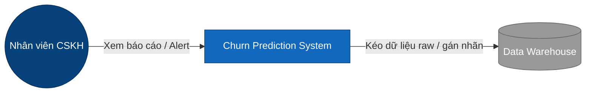

# Kiến trúc Hệ thống (System Architecture)

> [!NOTE]
> Tài liệu này mô tả kiến trúc tổng thể của hệ thống Churn Prediction. Các quyết định kiến trúc cụ thể nằm trong thư mục `docs/adr/`.

## 1. Tổng quan (Overview)
# TODO(author): Viết 1 đoạn giới thiệu ngắn gọn về hệ thống, giá trị nghiệp vụ (business value), và người dùng cuối.

## 2. Ranh giới hệ thống (Context Diagram - C4 Level 1)
# TODO(author): Vẽ sơ đồ Context (dùng Mermaid) mô tả việc hệ thống Churn Prediction tương tác với các hệ ngoài (Database CSKH, Data Warehouse, API Gateway, v.v.).

## 3. Kiến trúc Container (Container Diagram - C4 Level 2)
# TODO(author): Thêm sơ đồ chi tiết về các thành phần bên trong (ví dụ: API Service, Airflow Scheduler, ML Workers, Prometheus, PostgreSQL).

## 4. Các module chính (Key Modules)
- **Ingestion**: # TODO(author): Mô tả trách nhiệm của module Ingestion (Raw data -> Staging).
- **Features Engineering**: # TODO(author): Mô tả việc trích xuất và lưu trữ đặc trưng.
- **Modeling (V2)**: # TODO(author): Mô tả kiến trúc huấn luyện và sinh điểm (Training/Scoring pipelines).
- **API/Serving**: # TODO(author): Mô tả HTTP Server đáp ứng request runtime.

## 5. Chiến lược công nghệ (Technology Stack)
# TODO(author): Cập nhật Stack hiện tại
- **Language**: Python 3.10+
- **Orchestration**: Apache Airflow
- **Infrastructure**: Kubernetes / Docker-compose (Local)
- **ML Framework**: Scikit-learn / XGBoost (Chưa xác nhận)
- **Database**: PostgreSQL
- **Observability**: Prometheus & Grafana

## 6. Trade-offs (Sự đánh đổi)
# TODO(author): Liệt kê nhanh những điểm giới hạn đã chấp nhận (VD: Không realtime, chỉ batch processing; hoặc không tách microservices ngay từ đầu).
